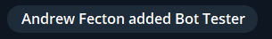
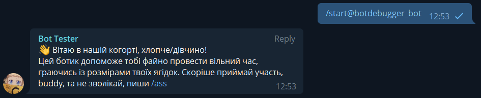
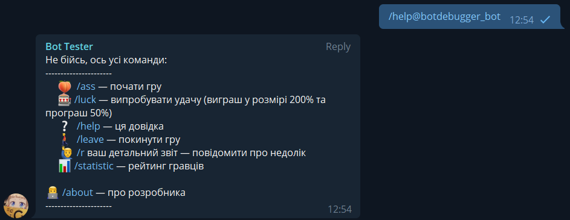
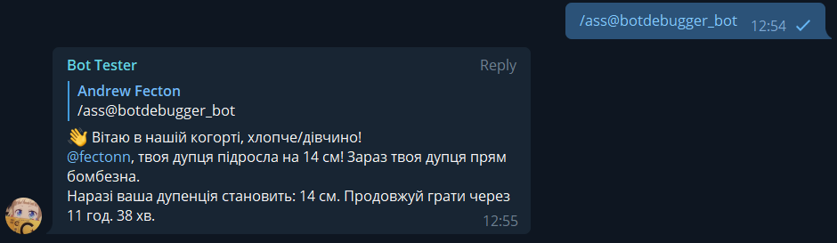
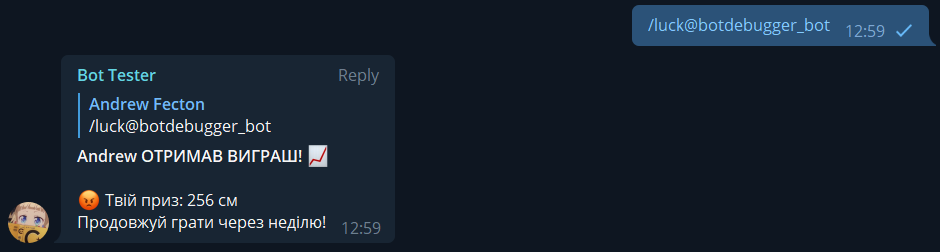
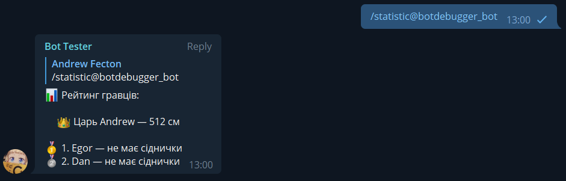
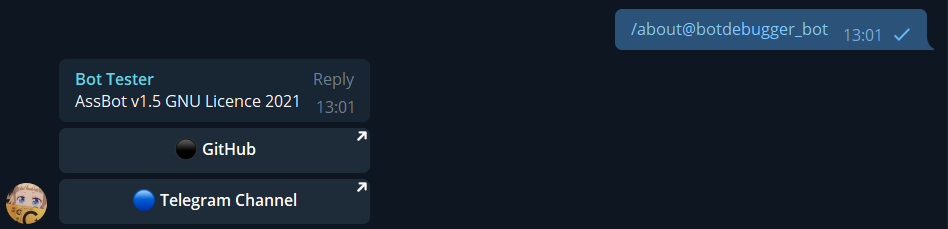

# 🇺🇦 AssBot (open-source Ebobot)


## Description
This bot is like "Ebobot" @kraft28_bot but that's open-source was written on Python.</p>

## Configuration
### Typical .env file
- TOKEN=here is your telegram token
- OWNER=here is owner's telegram id
### Example:
```python
TOKEN=1777031958:AAF4O-_GmkvFJvhP7cVlxa697Y48rUPC4Hc
OWNER=37592934
```

## Configuration in config.py
- DB_NAME - database name
- TOKEN - token which gets in .env file
- SUPER_USERS - owners id which gets in .env file and you can add other to list

## Python Dependencies
Recommended Python version: Python 3.10.5
### Modules in use:
- random
- sqlite3
- os
- time
- aiogram

## Running the bot
Creating a virtual enviroment
```bash
python3 -m venv venv
```

Activate venv
```bash
source venv/bin/activate
```

Installing necessary modules
```bash
pip3 install -r requirements.txt
```

Run the bot
```bash
python3 app.py
```
Deativate venv
```bash
deactivate
```

## User Commands
- /start — greet the bot
- /ass — start playing
- /luck — try your luck
- /help — show help message
- /leave — leave game and delete user's data
- /r text — send report to `reports` table
- /statistic — show top list of users
- /about — show info about the developer

## Admin's commands
- /admin — show admin commands
- /bl group_id — show banned users
- /ban group_id user_id — add user to blacklist
- /groups — show groups id and name where bot are using
- /ub group_id user_id — unban user
- /reports — show all reports from table `reports`
- /dreports — show all reports from table `reports` (detailed form)
- /clear — delete all rows in table `reports`
- /notify — notify all groups by your message

## Screenshots

> Adding bot to the group (it needs for creating a group's table)


> **/start**


> **/help**


> **/ass** (your ass can reduce and icrease by random or stay without changes)


> **/luck** (allows after 100cm)


> **/statistic**


> **/leave**


> **/about**


